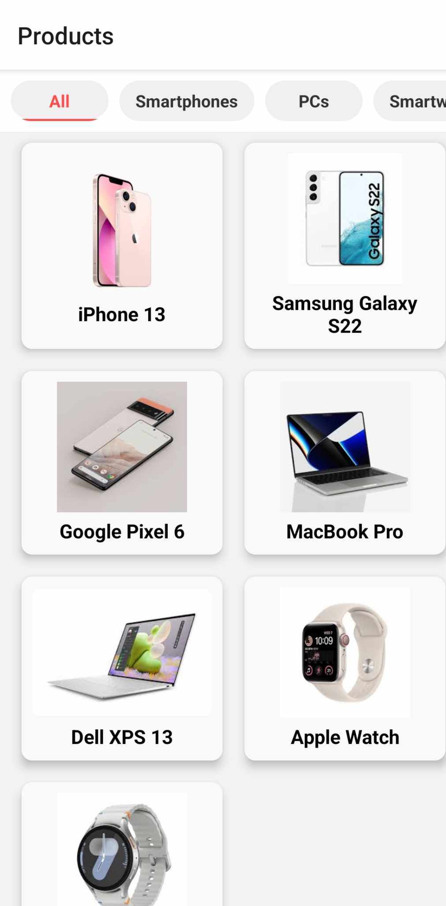

# React Native Product List App

## Table of Contents
- [Project Overview](#project-overview)
- [Features](#features)
- [Technologies Used](#technologies-used)
- [Screenshots](#screenshots)
- [Installation](#installation)

## Project Overview
This is a simple React Native app that displays a list of products with images, categories, and details. Users can browse products by category and view detailed information on each item.

## Features
- Displays a list of products in a grid format  
- Category tabs for filtering products  
- Product detail screen with an image and description

## Technologies Used
- React Native
- React Navigation
- Expo (for development and testing)
- JavaScript/ES6

## Screenshots
| Product List | Product Details |
|-------------|----------------|
|  |  |

## Installation
1. Clone the repository:  
   ```bash
   git clone https://github.com/RaniaDg12/TestProjects.git
   cd TestProjects/ReactNative-Test
   ```

2. Install dependencies:
 ```bash 
 npm install
```
3. Start the app with Expo:
 ```bash
npx expo start
 ```
4.Scan the QR code with Expo Go on your mobile device or run it in an emulator.
